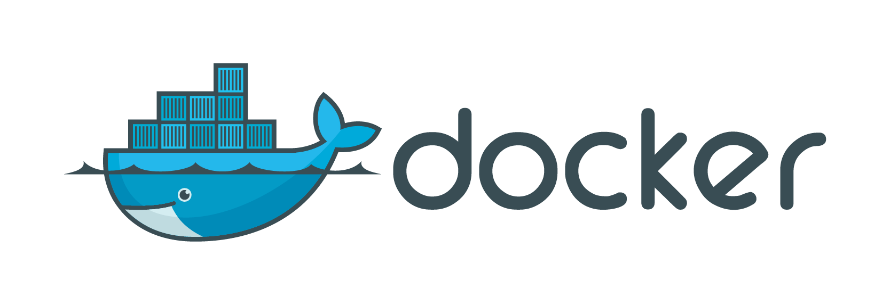

:Created: 2015-08-30
:Updated: 2016-08-31
:Version: 0.0.4

Jenkins Server
  - `bvberkum/jenkins-server <//hub.docker.com/r/bvberkum/jenkins-server>`_

    .. image:: https://badge.imagelayers.io/bvberkum/docker-jenkins:latest.svg
        :target: https://imagelayers.io/?images=bvberkum/docker-jenkins:latest
        :alt: Get your own badge on imagelayers.io

Features
  - Customized Jenkins docker has CLI and JJB pre-installed::

      docker exec -ti $cname jenkins-cli help
      docker exec -ti $cname jenkins-jobs help

  - Use JJB templates and initialize Jenkins jobs from YAML::

      jenkins-jobs update my-build.yaml

  - Build job configurations from JJB templates from dotmpe/jenkins-templated-builds.
    Use presets values with templates, or fill out placeholders using
    generate, and write new YAML formatted jobs::

      cd $JTB_SRC_DIR
      ./bin/jtb.sh compile-preset gh-jtb
      jenkins-jobs update gh-jtb.yaml:tpl/base.yaml

    Or use generate custom jobs based on templates directly from environment vars in shell scripts::

      name=jtb job-template-builder.py generate <tpl-id> <tpl-files> > my-build.yaml

    And trigger the build::

      docker exec -ti $cname jenkins-cli build <job-id>

Build, start, and configure::

  ./build.sh && \
  ./run.sh && \
  ./config.sh

The main script is ``init.sh``. That and other scripts above take arguments
``[env [tag]]`` (default ``dev latest``).

Refer to those scripts for functionality. Documentation is not mantained and
can easily be out of date. Script `inits.sh`` has a few pre-configurations.

Dev
----
- `Versions <ChangeLog.rst>`__
- `Setup guide <doc/setup.rst>`__

Branches
  master
    Releases. Stable, tested code.
  dev
    Development, testing.

Issues
  - CLI works except with stdin. Taking the JAR out the container does not help.
    Made one built-in function (init_cb_folder) to generate new folders.

Wishlist
  - Want to initialize title, preferably from fontfile and svg or someting.
    Right now copies custom/title.png and custom/headshot.png.

  - <primaryView>Testing</primaryView>
  - Misc. initial settings now done by hand:

    - Turn of HTML description filtering in security settings (done)
    - Set Simple Theme to userContent.css/js (done)
    - Add public key to user (done)
    - Get API key from user (for JJB)
    - Setup slaves (initial setup done)
    - Add docker cloud settings (done)

    - TODO: set admin email, mailhost

    - added better list view(s) (done),
      TODO: set default view
      config.xml: <primaryView>Testing</primaryView>

    - some global choice parameters?
    - add console output parsing rules..
    - migrate/package Build Failure Analyzer files?

    - may also try 'jvm_options' = '-Djenkins.install.runSetupWizard=false'
      for manual 2.0 setup.

    - Can use cURL for some provisioning:
      https://gist.github.com/stuart-warren/7786892

.. raw:: html

    <link rel="stylesheet" href="https://maxcdn.bootstrapcdn.com/font-awesome/4.4.0/css/font-awesome.min.css">
    <link rel="stylesheet" href="https://rawgit.com/wesbos/Font-Awesome-Docker-Icon/master/fontcustom/fontcustom.css">

    <i class="fa fa-docker"></i>

.. image:: jenkins-logo.png

